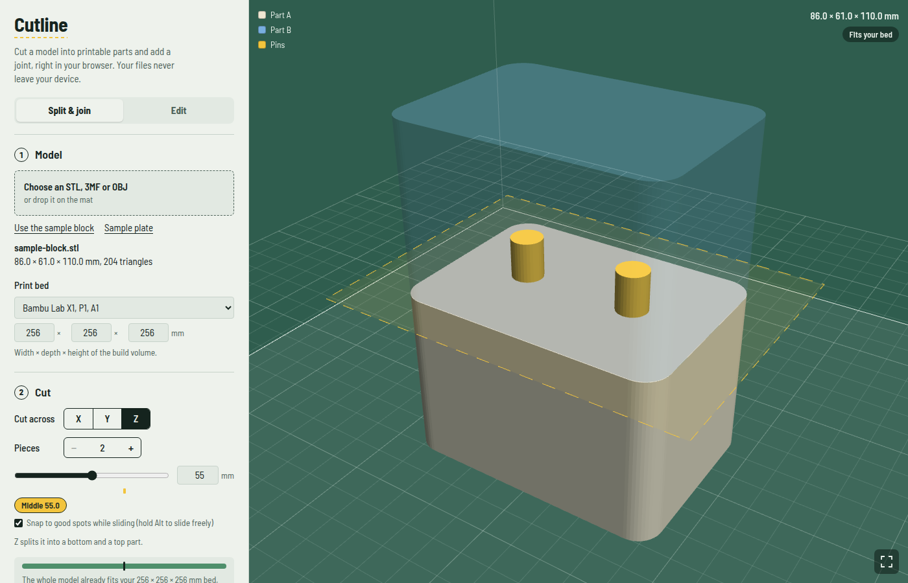

# Cutline

**Split 3D prints into parts and add joints, right in your browser.**

Cutline cuts a model that's too big for your printer (or just awkward to print) into pieces. It adds a joint so the pieces fit back together, then gives you print-ready files. Everything runs on your own device. Your files are never uploaded anywhere.

**Try it:** https://3dprinting.celikovic.xyz



## Features

- **Open** STL, 3MF and OBJ files. Drag and drop works.
- **Print bed presets** (Bambu Lab, Prusa, Creality) or a custom build volume. Includes "cut to fit my bed".
- **Cut** along X, Y or Z into any number of pieces. The cut slider snaps to good spots.
- **Joints:**
  - Dovetail and angled dovetail
  - Dowel pins
  - Snap fit
  - Thread
  - Magnet pockets
  - For flat parts: puzzle cut and a full jigsaw puzzle
- **Extras:** seam bevel, glue groove, optional magnets, and a printable clearance test to tune the fit for your printer.
- **Edit the model before cutting:** scale, rotate, mirror, lay flat on a face, trim, screw or magnet holes (M2–M6, countersink), and added blocks or cylinders. Full undo/redo.
- **Inspect the result:** exploded, assembled or print-layout views, X-ray, section view, isolate a part, and an assembly animation.
- **Filament estimate** by material, infill and price per kg.
- **Export** a `.zip` with one STL per part, the pins, and a 3MF with everything laid out, oriented ready to print.

## Running it locally

Cutline is a single self-contained `index.html`. No build step, no server code.

```sh
git clone https://github.com/anelcelik/CutLine3d.git
cd CutLine3d
python3 -m http.server 8000   # then open http://localhost:8000
```

Opening `index.html` straight from disk also works in most browsers. It needs an internet connection the first time, to load three.js, fflate and the font from their CDNs.

## Built with

- [three.js](https://threejs.org/) for 3D rendering (MIT)
- [Manifold](https://github.com/elalish/manifold) for robust mesh booleans, bundled as WebAssembly (Apache-2.0)
- [fflate](https://github.com/101arrowz/fflate) for zip and 3MF packaging (MIT)
- [Barlow Semi Condensed](https://fonts.google.com/specimen/Barlow+Semi+Condensed) (SIL OFL 1.1)

## License

[MIT](LICENSE) © 2026 Anel Celikovic. The third-party libraries above keep their own licenses.
